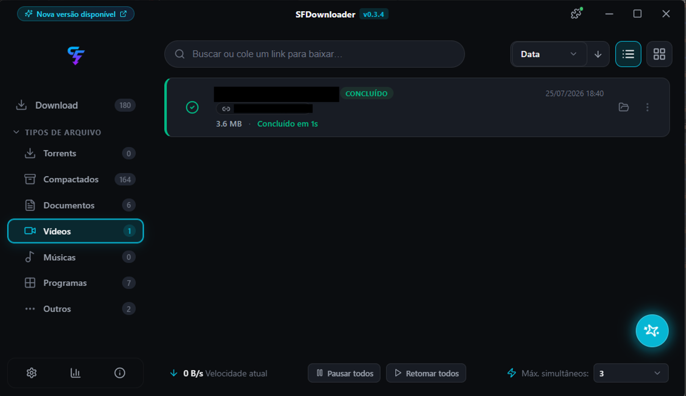
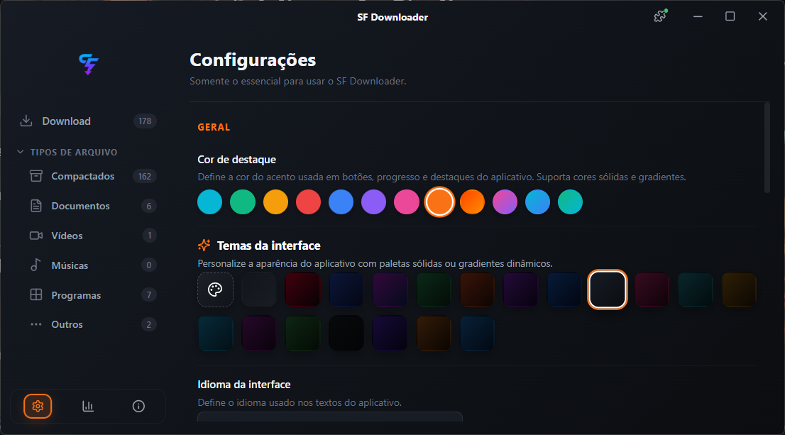
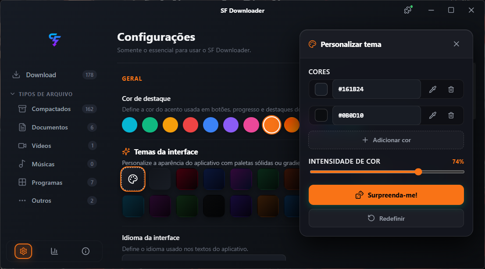
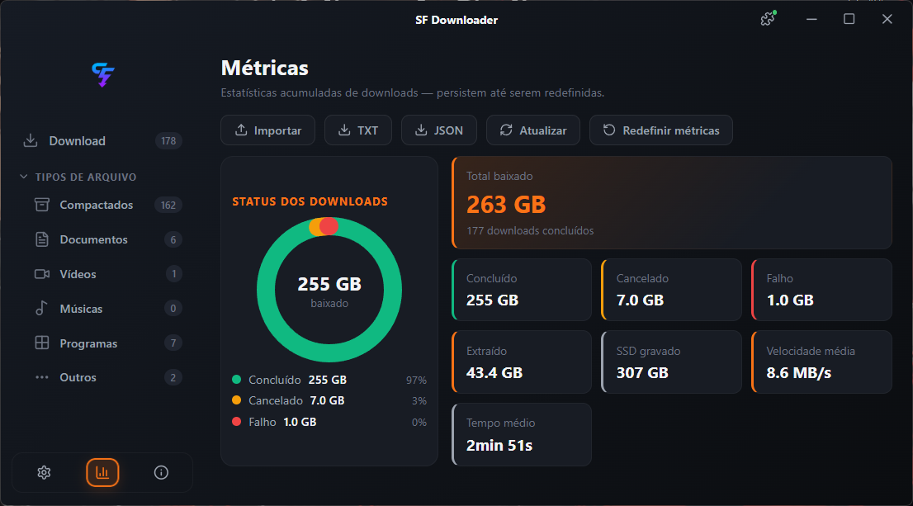
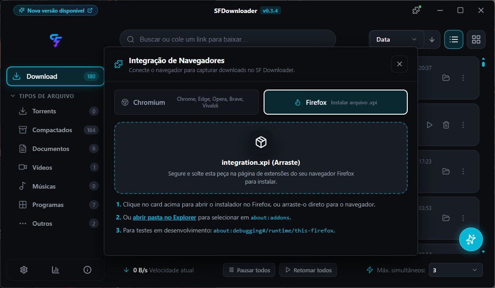

<div align="center">

# ⚡ SFDownloader

**Gerenciador de downloads moderno, rápido e elegante para Windows.**

Construído com **Tauri 2 + React + Rust** — leve, nativo e sem Electron.

[](https://github.com/NskBR/SFDownloader-BETA/releases)
[](https://tauri.app)
[](https://react.dev)
[](https://www.rust-lang.org)

</div>

> [!WARNING]
> **⚠️ AVISO DE DESENVOLVIMENTO (BITTORRENT)**:  
> O suporte a downloads BitTorrent encontra-se em **fase ativa de desenvolvimento**. O sistema está parcialmente funcional, porém ainda apresenta **bastante inconsistência**. Recomendamos utilizar prioritariamente downloads HTTP/HTTPS diretos enquanto aprimoramos o motor Torrent.

---

## 📸 Capturas de Tela

### Lista de Downloads
> Visualize todos os seus downloads organizados por tipo de arquivo, com filtros por categoria, ordenação persistente e modos de exibição em lista ou grade.



### Configurações e Personalização
> Cores de destaque sólidas e gradientes, temas de interface com paletas pré-definidas e seletor de idioma.



### Customizador de Temas
> Crie seu próprio tema com múltiplas cores gradiente, pipeta de cor, controle de intensidade e botão "Surpreenda-me!" para gerar combinações aleatórias.



### Métricas e Estatísticas
> Painel completo com total baixado, volume por status, escrita em disco, velocidade média e tempo médio por download — tudo exportável em TXT ou JSON.



### Integração com Navegadores
> Extensão nativa para Chromium (Chrome, Edge, Opera, Brave, Vivaldi) e Firefox. Captura links automaticamente e envia direto para o SF Downloader.



---

## ✨ Funcionalidades

### Motor de Download
- 🚀 **Downloads segmentados** com HTTP Range para máxima velocidade
- ⏸️ **Pausa e retomada** inteligente com validação de ETag/Last-Modified
- 📦 **Extração automática** de arquivos compactados (ZIP, RAR, 7Z, TAR)
- 🔄 **Recuperação automática** de downloads interrompidos na inicialização
- ⚡ **Downloads simultâneos** com controle de concorrência configurável
- 📁 **Organização automática** por tipo de arquivo em pastas categorizadas

### Interface
- 🎨 **Temas personalizáveis** — paletas sólidas, gradientes dinâmicos e cores de destaque
- 🌈 **Cores de destaque** — 8 cores sólidas + 4 gradientes futuristas
- 🖱️ **Menu de contexto** completo com clique direito
- 📊 **Métricas detalhadas** com gráfico donut e cards de estatísticas
- 🔍 **Busca e filtros** por categoria, status, tamanho e data
- 📋 **Seleção múltipla** com Shift + Click e Ctrl + Click
- 🖥️ **Janela de progresso** independente com indicador circular gradiente

### Extensão de Navegador
- 🌐 **Chromium** — Chrome, Edge, Opera, Brave, Vivaldi
- 🦊 **Firefox** — Compatível e validado para Mozilla AMO
- 🎯 **Captura automática** de downloads com filtros por extensão
- 🔗 **Protocolo `sfdownloader://`** para comunicação desktop ↔ navegador

### Técnico
- 💾 **SQLite embarcado** com migrações versionadas
- 🪶 **~5 MB de instalação** — sem runtime pesado
- 🖤 **Sem flash branco** — cor de fundo nativa desde a criação da janela
- 🔒 **Arquivos temporários isolados** na pasta `.sf-temp`
- 📡 **Deep links** para integração com navegadores e apps externos

---

## 🛠️ Tecnologias

| Camada | Tecnologia |
|--------|-----------|
| **Frontend** | React 18, TypeScript, Lucide Icons, CSS puro |
| **Backend** | Rust (Tokio, reqwest, rusqlite) |
| **Framework** | Tauri 2.0 (WebView2 no Windows) |
| **Banco de Dados** | SQLite 3 embarcado |
| **Extensão** | WebExtensions API (Manifest V3 + V2) |

---

## 🚀 Como Executar

### Pré-requisitos

- [Node.js](https://nodejs.org/) 18+
- [Rust](https://rustup.rs/) toolchain estável
- [Tauri CLI](https://tauri.app/start/) v2

### Desenvolvimento

```bash
# Instalar dependências
npm install

# Executar em modo desenvolvimento
npm run tauri dev
```

### Build de Produção

```bash
# Compilar instalador (.msi / .exe)
npm run tauri build
```

### Extensão de Navegador

```bash
# Compilar extensões para Chromium e Firefox
npm run extension:build
```

Os builds ficam em `browser-extension/dist-chromium/` e `browser-extension/dist-firefox/`.

---

## 📂 Estrutura do Projeto

```
SF Downloader/
├── src/                    # Frontend React + TypeScript
│   ├── app/                # Composição e navegação
│   ├── components/         # Componentes reutilizáveis (UI, downloads)
│   ├── domain/             # Tipos e modelos de domínio
│   ├── hooks/              # React hooks customizados
│   ├── pages/              # Telas (Downloads, Settings, Metrics...)
│   ├── services/           # Serviços (tema, download, storage)
│   └── styles/             # CSS global e temas
├── src-tauri/              # Backend Rust + Tauri
│   ├── src/commands/       # Comandos IPC (transfer, settings, metrics)
│   ├── src/database/       # SQLite, migrações e repositórios
│   └── src/engine/         # Motor de download segmentado
├── browser-extension/      # Extensão WebExtensions (Chromium + Firefox)
├── screenshots/            # Capturas de tela para o README
└── docs/                   # Documentação técnica
```

---

## 🗺️ Roadmap

- [x] Motor de download HTTP/HTTPS com segmentação
- [x] Pausa, retomada e cancelamento
- [x] Extração automática de arquivos compactados
- [x] Organização por tipo de arquivo
- [x] Extensão para Chromium e Firefox
- [x] Métricas e estatísticas detalhadas
- [x] Temas e cores de destaque personalizáveis
- [x] Gradientes dinâmicos multi-stop
- [ ] Limitação dinâmica de velocidade por download
- [ ] Fila de downloads sequencial com prioridades
- [ ] Agendador de downloads por horário
- [ ] Integração via Native Messaging (sem abas temporárias)
- [ ] Suporte a BitTorrent / SFTP

---

## 📄 Licença

Este projeto é de uso privado durante a fase Beta.

---

<div align="center">

**Feito com ☕ e Rust por [NskBR](https://github.com/NskBR)**

</div>
